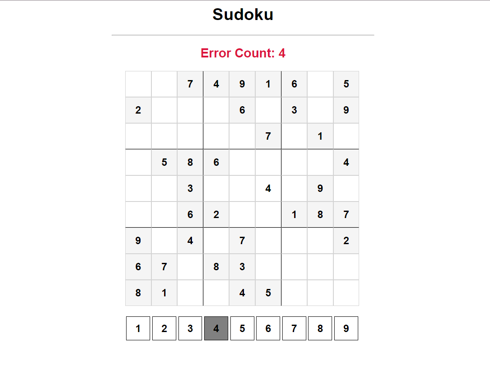

# Sudoku Game



This repository contains a simple Sudoku game with a web-based interface. You can play Sudoku puzzles, make selections, and track your error count. The game is implemented using HTML, CSS, and JavaScript.

## Features

- Interactive Sudoku game with a user-friendly web interface.
- Track the number of errors you make during the game.
- Randomly generated Sudoku puzzles.
- Click on cells to select them and choose numbers to fill them in.
- Check your solutions in real-time.
- Clear and understandable codebase for learning and customization.

## Getting Started

To play the Sudoku game locally or contribute to its development, follow these instructions:

1. Clone this repository to your local machine:

   ```bash
   git clone https://github.com/25-Shikhar-K/sudoku-game.git

2. Open the project folder and explore the HTML, CSS, and JavaScript files.

3. You can modify the `board` variable in `sudoku.js` to create different Sudoku puzzles.

4. To run the game locally, simply open the `index.html` file in your web browser.

## Contributing

Contributions are welcome! If you'd like to improve this Sudoku game or have suggestions for new features, please open an issue or create a pull request.

## License

This Sudoku game is licensed under the [MIT License](LICENSE.md). You are free to use, modify, and distribute this software as long as you include the original license in your distribution.

Enjoy playing Sudoku! If you have any questions or encounter any issues, feel free to open an issue in this repository. Happy Sudoku solving!


